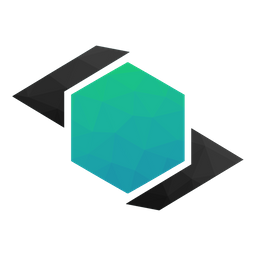

# Iris

## What's Iris?

Iris is a full featured generator, here is a detailed list of all the features currently supported.


This wiki is a **work in progress**. If something is missing, please visit our [Discord ](https://discord.com/invite/3xxPTpT)server.


### Features

* Support Spigot and Paper for 1.14 and up
* The Iris Overworld has over 100 biomes, 2,000 schematics & loads of detail. You can view the overworld project at [https://github.com/IrisDimensions/overworld](https://github.com/IrisDimensions/overworld)
* Parallel Chunk Generation + Per Chunk multicore chunk gen. Iris takes multicore generation a step further for even more performance.
* Optimized [Pregeneration ](plugin/commands.md#iris-pregen)allows Iris to pregenerate worlds even faster due to the order of generation & caching!
* Fully customizable [dimensions ](engine/understanding/dimensions.md)with "projects". Make your own biomes, regions, schematics & decorations with ease.
  * Iris has a "Studio" mode which allows you to design dimensions in schema supported json \(autocomplete\)
  * No biome limits
  * As you design your world, keep flying & see your changes hotload into the generator
* Iris cannot cascade, ever! It generates schematics \(objects\) in a separate region space \(memory & storage\) the writes only the cross-sections into generating chunks. It's called the Parallax Layer
* Fast biome finding with /iris goto
* Project downloading & generating from github

### Terrain Features

Iris is a fully featured terrain generator. Terrain features are specific to what Iris is capable of generating

* Unlimited 3D Biomes
* Cave Biomes
* Region Specific Shore, Ocean & Land Biomes
* Biome Spot & Ridge Overrides
* Total BlockState abstraction: Define block states fully, not just the type
* More than 50 noise generator types to choose from \(when designing worlds\) Simplex, Perlin, Cellular, Static, Fractal, FBM to name a few
* A new type of interpolation, designed for Iris: Starcat. Take a look [here](https://imgur.com/a/Y0K2qC7) for more details. Billinear, BiHermite, BiCubic, Starcast & Other tension variants included
* 3D Noise Carving
* Per Biome noise generation with height-bound based interpolation for smoothness instead of raw noise interpolation
* Schematics \(Objects\) up to 512 x 256 x 512 blocks
* Fully featured structure system which support infinite structures
* Support for custom block states \(custom block/resource packs\)
* Deposit Generators \(Used for ore gen usually\). Make deposits of any type and size
* Multi layered decorations \(decorates caverns caves, under carvings\)

## Download Iris on [Spigot ](https://www.spigotmc.org/resources/iris-world-gen-the-dimension-engine.84586/)or [Polymart](https://polymart.org/resource/iris-world-gen.737)

