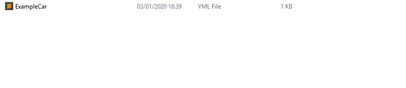
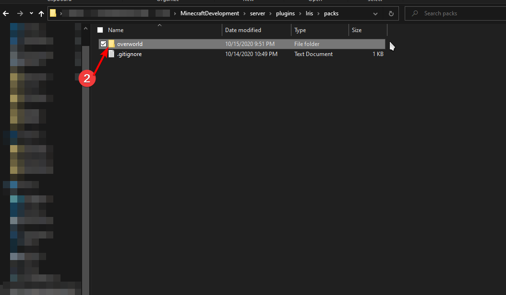
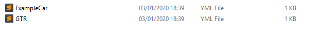

# Creating new vehicles \(WIP\)


Please visit our [legacy wiki](https://github.com/VolmitSoftware/VehiclesPlus/wiki) to begin creating new vehicles


## Step 1

Head into the VehiclesPlus folder, then click on the vehicles folder, then flick on the folder of the vehicle type you want to add

## Step 2

For this tutorial, i will be using the car type

Copy the ExampleCar.yml file and rename it to the new name of the vehicle







## Step 3

Now we will open the newly copied file, I recommend using Notepad++ but there are a lot of other programms that will work too

It will look like this

```text
# This is for the serialization of the vehicle. DO NOT TOUCH THIS!
className: me.legofreak107.vehiclesplus.vehicles.objects.BaseVehicle

# This is the name of the vehicle
name: ExampleCar

# This is the type of the vehicle, you can change CarType to (BikeType, BoatType, PlaneType, HelicopterType, TankType, HovercraftType)
vehicleType: me.legofreak107.vehiclesplus.vehicles.objects.types.CarType

# This is a list of base colors the vehicle comes in, when a players buy vehicles they can click on one of those colors
# You can add as much colors as you want, just copy the items and paste them. Make sure to rename the list tags.
baseColorList:
  list0:
    ==: Color
    RED: 255
    BLUE: 0
    GREEN: 0
  list1:
    ==: Color
    RED: 0
    BLUE: 0
    GREEN: 0
  list2:
    ==: Color
    RED: 255
    BLUE: 255
    GREEN: 255
  list3:
    ==: Color
    RED: 128
    BLUE: 128
    GREEN: 128
  list4:
    ==: Color
    RED: 192
    BLUE: 192
    GREEN: 192

# This is a list of parts the vehicle has. This list contains (Seats, Skins, Wheels and all other visible addons)
# You can add as much addons as you want, just copy the items and paste them. Make sure to rename the list tags.
partList:
  list0:
    className: me.legofreak107.vehiclesplus.vehicles.objects.base.Skin
    skin:
      ==: org.bukkit.inventory.ItemStack
      type: LEATHER_BOOTS
      damage: 1
      meta:
        ==: ItemMeta
        meta-type: LEATHER_ARMOR
        Unbreakable: true
    color:
      ==: Color
      RED: 255
      BLUE: 255
      GREEN: 255
    xOffset: 0.0
    yOffset: 0.0
    UID: 3be4535f-3ba0-4071-bc05-18edba786411
    zOffset: 0.0
    isCustomPlaced: false
  list1:
    className: me.legofreak107.vehiclesplus.vehicles.objects.base.Seat
    steer: true
    xOffset: -0.2
    yOffset: -1.45
    UID: cf704624-d5ad-40ef-974d-cf548237863c
    zOffset: 0.45
    isCustomPlaced: false
  list2:
    className: me.legofreak107.vehiclesplus.vehicles.objects.base.Seat
    steer: false
    xOffset: -0.2
    yOffset: -1.45
    UID: 572961b2-a246-43e5-a65a-94d54951f8c6
    zOffset: -0.45
    isCustomPlaced: false
  list3:
    className: me.legofreak107.vehiclesplus.vehicles.objects.base.Seat
    steer: false
    xOffset: -1.0
    yOffset: -1.45
    UID: 974768af-7149-497e-9f8a-586a1f337ebc
    zOffset: 0.45
    isCustomPlaced: false
  list4:
    className: me.legofreak107.vehiclesplus.vehicles.objects.base.Seat
    steer: false
    xOffset: -1.0
    yOffset: -1.45
    UID: 769a72b0-435a-478d-a764-861e91ab84bb
    zOffset: -0.45
    isCustomPlaced: false
  list5:
    className: me.legofreak107.vehiclesplus.vehicles.objects.base.Wheel
    steering: true
    rotationOffset: 180
    skin:
      ==: org.bukkit.inventory.ItemStack
      type: LEATHER_CHESTPLATE
      damage: 2
      meta:
        ==: ItemMeta
        meta-type: LEATHER_ARMOR
        Unbreakable: true
    color:
      ==: Color
      RED: 20
      BLUE: 20
      GREEN: 20
    xOffset: 1.8
    yOffset: 0.0
    UID: fa239f95-9706-4c84-81dc-fad43aa038f3
    zOffset: -1.1
    isCustomPlaced: false
  list6:
    className: me.legofreak107.vehiclesplus.vehicles.objects.base.Wheel
    steering: true
    rotationOffset: 0
    skin:
      ==: org.bukkit.inventory.ItemStack
      type: LEATHER_CHESTPLATE
      damage: 2
      meta:
        ==: ItemMeta
        meta-type: LEATHER_ARMOR
        Unbreakable: true
    color:
      ==: Color
      RED: 20
      BLUE: 20
      GREEN: 20
    xOffset: 1.8
    yOffset: 0.0
    UID: 43e0af40-de3c-4ac8-a32f-23c4a35de501
    zOffset: 1.1
    isCustomPlaced: false
  list7:
    className: me.legofreak107.vehiclesplus.vehicles.objects.base.Wheel
    steering: false
    rotationOffset: 180
    skin:
      ==: org.bukkit.inventory.ItemStack
      type: LEATHER_CHESTPLATE
      damage: 2
      meta:
        ==: ItemMeta
        meta-type: LEATHER_ARMOR
        Unbreakable: true
    color:
      ==: Color
      RED: 20
      BLUE: 20
      GREEN: 20
    xOffset: -1.67
    yOffset: 0.0
    UID: 439a6c92-c4b2-4a7c-b43e-9b2d641821a1
    zOffset: -1.1
    isCustomPlaced: false
  list8:
    className: me.legofreak107.vehiclesplus.vehicles.objects.base.Wheel
    steering: false
    rotationOffset: 0
    skin:
      ==: org.bukkit.inventory.ItemStack
      type: LEATHER_CHESTPLATE
      damage: 2
      meta:
        ==: ItemMeta
        meta-type: LEATHER_ARMOR
        Unbreakable: true
    color:
      ==: Color
      RED: 20
      BLUE: 20
      GREEN: 20
    xOffset: -1.67
    yOffset: 0.0
    UID: 685d05d7-9600-4760-b85a-33e0b59174ce
    zOffset: 1.1
    isCustomPlaced: false

# This are the speed settings of the vehicle. The base is the base speed it has when it is new, each upgrade will add the step value to the base until it reaches the max.
speedSettings:
  className: me.legofreak107.vehiclesplus.vehicles.objects.base.storage.StorageUpgradeable
  base: 100
  max: 200
  step: 5
  upgradeCost: 1000

# This are the fuel tank settings of the vehicle. The base is the base size it has when it is new, each upgrade will add the step value to the base until it reaches the max.
fuelTankSettings:
  className: me.legofreak107.vehiclesplus.vehicles.objects.base.storage.StorageUpgradeable
  base: 50
  max: 100
  step: 5
  upgradeCost: 1000

# This are the turning settings of the vehicle. The base is the base turning it has when it is new, each upgrade will add the step value to the base until it reaches the max.
turningRadiusSettings:
  className: me.legofreak107.vehiclesplus.vehicles.objects.base.storage.StorageUpgradeable
  base: 7
  max: 15
  step: 1
  upgradeCost: 1000

# This are the acceleration settings of the vehicle. The base is the base acceleration it has when it is new, each upgrade will add the step value to the base until it reaches the max.
accelerationSettings:
  className: me.legofreak107.vehiclesplus.vehicles.objects.base.storage.StorageUpgradeable
  base: 50
  max: 100
  step: 5
  upgradeCost: 1000

# This are the horn settings of the vehicle, here you can enable the horn and change the sound.
hornSettings:
  className: me.legofreak107.vehiclesplus.vehicles.objects.base.storage.StorageHorn
  enabled: true
  sound: BLOCK_NOTE_BASS

# This is the drift option, if enabled. The vehicle can drift using space
drift: true

# This are the exhaust settings of the vehicle. Here you can enable and disable the particles, as well as setting the offset and the particle type
exhaustSettings:
  className: me.legofreak107.vehiclesplus.vehicles.objects.base.storage.StorageSmoke
  enabled: true
  xOffset: -5.0
  yOffset: 0.0
  zOffset: 0.0
  particleName: SMOKE_LARGE

# Can the player exit while the vehicle is moving
canExitWhileMoving: true

# The price of the vehicle when purchased in the shop. If 0 it is not displayed in the shop
price: 100000.0

# The fuel settings of the vehicle, here you can set the usage per 100KM on average speed and the type.
fuelSettings:
  className: me.legofreak107.vehiclesplus.vehicles.objects.base.storage.StorageFuel
  usage: 6.0
  type: GASOLINE

# The vehicle health
health: 100

# The trunk size of a vehicle, this HAS to be a multiple of 9
trunkSize: 27

# The hitbox settings of a vehicle
hitbox:
  className: me.legofreak107.vehiclesplus.vehicles.objects.base.storage.StorageHitbox
  length: 3.0
  width: 2.0
  height: 1.0
```

## Step 4

When you are done editing, save the file and use /vo reload to reload the data

