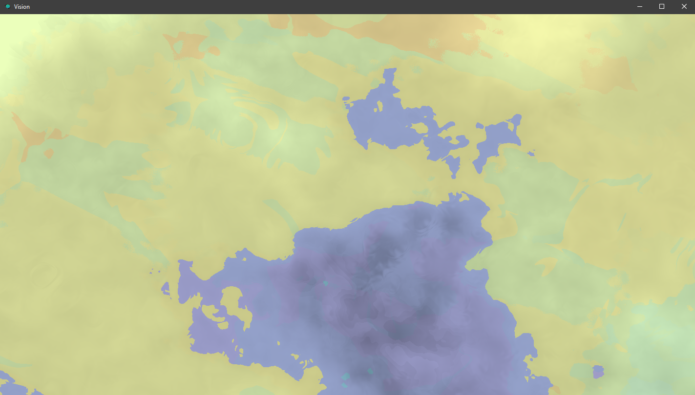

# Biome Parameters Part 1

```javascript
{
"biomeZoom": 0,
"carvingBiome": "beach",
"childShrinkFactor": 0,
"derivative": "BEACH",
"lockLayers": false,
"lockLayersMax": 0,
"name": "Beach",
"rarity": 0,
"fluidType": "",
"debugColor": "",
}
```

## Biome Zoom

**This zooms in the biome colors if multiple derivatives are chosen:**  
Imagine using a crumpled ball of paper, then zooming into it. that's what this does. margionally pointless with only 1 derivative  
Default: **1** Min: **1.0e-4** Max: **512**

## Carving Biome

When iris carves in this biome, this is the biome that gets plastered in that region. This is a great way to make carves sound spooky in the dark. Any vanilla biome is supported here.

## Child Shrink Factor

This defines the layers of materials in this biome. Each layer has a palette and min/max height and some other properties. Usually a grassy/sandy layer then a dirt layer then a stone layer. Iris will fill in the remaining blocks below your layers with stone. List of _BiomePaletteLayers \(Objects\)_

## Derivative \(from [here](../../understanding/biomes.md#derivatives)\)

Derivatives are fairly straightforward, in what they do- should hopefully be a simple concept to understand. That being said, it plays an important role in biome creation. This will determine what mobs spawn \(that can be tweaked to prevent this\), What the color of blocks will be \(Grass being green to dark brown etc\), and some of the sounds you may hear \(can also be tweaked\). **As a visual see below:**

| Blocks | Mob Spawns | Audio |
| :--- | :--- | :--- |
| Will change depending on what the derivative is, and you **can not change this anywhere but here.** | The mobs that spawn will mirror whatever the derivative is in vanilla terms \(Cow in forest, Ghast in Nether Wastes\) mobs can be changed elsewhere. | Some of the audio you might hear in this biome is from the derivative, this can be changed elsewhere. |

```text
    "derivative":"FOREST"
```

## Lock Layers

The layers to iterate below the surface for locked layer biomes \(mesa\). This is very good at creating a mesa or stacked style of terrain, There is nothing from carving to smoothing that will cancel this from generating. this affects the terrain layer and below. ASSUMING that you marked it as **true**

## Lock Layers Max

This is an important key to remember, if you are locking layers, and you have a set of layers. This represents the max possible layers that can stack, assuming that locklayers is on, and you have layers defined.

## Name

**The human readable name of this biome**  
Name of biome. no real explanation needed

## Rarity

**The rarity of this biome \(integer\)**  
Generally speaking the higher the number is, the more common it is, but if you have only a few biomes try to keep the results as you would want, try and keep it under 256 \(you can go higher\), but higher would make the biome almost invisible in a general schema of 100 biomes, as every biome \(and region\) is a roll at random EACH usage so if its 1-in-10, there will NOT guarantee a biome every 10, as its a random roll.

## Fluid Type

**The fluid type that should spawn here**  
The type of fluid if this biome is underwater. To 'defer' this value to whatever the parent dimension fluid type is, use an empty string. you can see fluid settings\(dim\) [here](../universal-parameters/#fluid-breakdown).

## Debug Color

**Debug color for visualizing this biome with a color in the MAP.** ie: \#F13AF5  
This in the map changes the visual representation of a biome so you can see it more clearly, in the image below any of the colors represent a biome, and how the noise/layers interact with them.




If you want to know how to use this tool to see biomes go [here](../../../plugin/commands.md#iris-studio-map-render)


