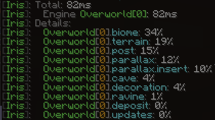

# Commands


Many of the commands on this page may have one or more _alias_ commands between brackets behind their main title. This means that you can also run that command with the alias. Example: `/ir std o`does the same as `/iris studio open`

Any parameter in between `[` and `]` is optional, meaning they can be omitted. Parameters between `<` and `>` cannot be omitted.


If an issue report is mentioned with the command, there may be an issue in your version with this command. It might have been patched before this could be updated, so make sure to try yourself first.

## /iris create\(c, cr, new, +\)

Used to create worlds for gameplay use \(real, non-testing worlds\)

```text
/iris create <name> [type=<type>] [seed=<number>] [pregen=<blocksWide>]
```

| Parameter | Description | Example |
| :--- | :--- | :--- |
| name | The name of your world | myworld |
| type=&lt;type&gt; | The type \(this is an iris dimension pack you are referencing\) | type=overworld |
| seed=&lt;number&gt; | The seed number | seed=1234 |
| pregen=&lt;blocks&gt; | Optionally pregen this world on init using X by X blocks wide \(example is for a 5k by 5k map\) | pregen=5000 |

## /iris download\(dl\)

Download a pack from the online Iris repository

```text
/iris dl mars [-t|--trim]
```

<table>
  <thead>
    <tr>
      <th style="text-align:left">Parameter</th>
      <th style="text-align:left">Description</th>
    </tr>
  </thead>
  <tbody>
    <tr>
      <td style="text-align:left">-t|--trim</td>
      <td style="text-align:left">
        <p>Remove excess project files,</p>
        <p>and recompile into lightweight bare-minimum files.</p>
        <p>If you use <code>--trim</code> you should not use this for editing, only
          for generating.</p>
      </td>
    </tr>
  </tbody>
</table>

## /ir metrics\(stats, mt\)

Shows average generator statistics such as: Percentage of total time used for generating caves, for generating ravines, for generating objects, etc.



## /iris object\(o\)

Object commands are used for schematics

All command boxes after this will use the alias `o`.

### /iris object wand\(w\)

Gives you an Iris Object Wand. Functions just like a worldedit wand.

### /iris object dust\(dst, d\)

Gives you a powder which can be used to outline placed objects by clicking any block that is an element of that object.

### /iris object save

Saves the object to your project

```text
/iris o save <project> <name>
```

| Parameter | Description |
| :--- | :--- |
| project | The name of the project to save the object to |
| name | The name of the object |

### /iris object paste\(pasta, place, p\)

Paste an object

```text
/iris o paste <name> [-edit]
```

<table>
  <thead>
    <tr>
      <th style="text-align:left">Parameter</th>
      <th style="text-align:left">Description</th>
    </tr>
  </thead>
  <tbody>
    <tr>
      <td style="text-align:left">name</td>
      <td style="text-align:left">
        <p>The name of the object to paste</p>
        <p>An example object <code>tree</code> in the <code>trees</code> folder:</p>
        <p><code>/ir o paste trees/tree</code>
        </p>
      </td>
    </tr>
    <tr>
      <td style="text-align:left">-edit</td>
      <td style="text-align:left">
        <p>If this is specified, the pasted object</p>
        <p>will be selected automatically</p>
      </td>
    </tr>
  </tbody>
</table>

### /iris object &gt;

Shifts a selection in the direction you are looking

```text
/iris o > <number>
```

| Parameter | Description |
| :--- | :--- |
| number | The amount of blocks to shift |

### /iris object +

Expands a selection in the direction you are looking

```text
/iris o + <number>
```

| Parameter | Description |
| :--- | :--- |
| number | The amount of blocks to expand |

### /iris object -

Contracts a selection in the direction you are looking

```text
/iris o - <number>
```

| Parameter | Description |
| :--- | :--- |
| number | The amount of blocks to contract |

### /iris object x+y

Takes your selection and bumps it up by 1, then expands it's height to anything in it's bounds, then shrink-wraps the selection around the object.

### /iris object x&y

Does the same thing as x+y but expands downwards too./iris object p1

Selects the first position at your position and stores it in the wand

### /iris object p2

Selects the second position at your position and stores it in the wand

## /iris pregen

```text
/iris pregen <blocks>
```

<table>
  <thead>
    <tr>
      <th style="text-align:left">Parameter</th>
      <th style="text-align:left">Description</th>
    </tr>
  </thead>
  <tbody>
    <tr>
      <td style="text-align:left">blocks</td>
      <td style="text-align:left">
        <p>Generates the world you are currently in</p>
        <p>It does so from 0,0 outwards, up until it hits the <code>blocks</code> distance</p>
        <p>Inside this parameter, you can use certain multipliers,</p>
        <p>which you put after the value you entered</p>
      </td>
    </tr>
    <tr>
      <td style="text-align:left"></td>
      <td style="text-align:left"><code>c</code>- Multiplies the amount of 16 (one chunk)</td>
    </tr>
    <tr>
      <td style="text-align:left"></td>
      <td style="text-align:left"><code>r</code>- Multiplies by 512 (one region)</td>
    </tr>
    <tr>
      <td style="text-align:left"></td>
      <td style="text-align:left"><code>k</code>- Multiplies the amount by 1000</td>
    </tr>
  </tbody>
</table>


You can use this command in any world, even Studio and non-Iris worlds.


## /iris regen

```text
/iris regen <width>
```

<table>
  <thead>
    <tr>
      <th style="text-align:left">Parameter</th>
      <th style="text-align:left">Description</th>
    </tr>
  </thead>
  <tbody>
    <tr>
      <td style="text-align:left">width</td>
      <td style="text-align:left">
        <p>The width and height of the area to regenerate in chunks.</p>
        <p>Setting this to <code>5</code> will re-generate a 5 by 5 chunk area.</p>
        <p>The default is <code>1</code>, so you can omit the number and it will only</p>
        <p>regenerate the chunk you are currently in.</p>
      </td>
    </tr>
  </tbody>
</table>

## /iris reload\(rld\)

Force-reloads plugin configurations. You should not have to use this since Iris automatically updates your settings for you, but it may sometimes not, in which case this can be used.

## /iris studio\(std, s\)

Represents Iris Studio commands \(used when building & testing dimension projects\).

All command boxes after this will use the alias `std`.

### /iris studio create\(new, +\)

Used to create a new dimension project in Iris.

```text
/iris std create <name> [template=<existing>]
```


Using `/iris std new test template=flat` _\*\*_would create a new project called `test` but would have the content and properties of the existing dimension project `flat`. This is how you can easily create variations of existing projects without having to edit them or manage a bunch of files at the same time.


| Parameters | Description |
| :--- | :--- |
| name | The name of the project to create |
| template = | The template project to create this one from |

### /iris studio open\(o\)

Used to open an existing project and a few additional setup related updates.

* Opens VSCode with your project.
* Teleports you to a new \(test-\)world that generates based on your project \(hot-loading enabled\).

```text
/iris std open <name>
```

| Parameter | Description |
| :--- | :--- |
| name | Name of the project to open |

### /iris studio close\(x\)

Closes the currently opened project and destroys the project test world.

```text
/iris std x
```

### /iris studio package\(pkg\)

Packages your project into a compressed `.iris` file.

```text
/iris std pkg <name> [-o] [-m]
```

| Parameter | Description |
| :--- | :--- |
| name | Name of the project to package |
| -o | Obfuscate object names to UUID's |
| -m | Minify JSON |

### /iris studio tpstudio\(tps, stp\)

Teleports the player to the studio world

### /iris studio update\(u\)

Updates your VSCode workspace. This happens automatically whenever the project is opened or when a hot-load happens.

```text
/iris std u <name>
```

| Parameter | Description |
| :--- | :--- |
| name | The name of the project to update |

### /iris studio map\(render\)

Opens a desktop GUI to quickly render massive amounts of terrain on a 2d map you can zoom and pan around on. This is great for getting the shape of massive pieces of land or checking the land to ocean ratio in your project.


This command opens a GUI from the server process and is only advisable to use when you are developing a world with the server running on your local system. It is useless if you are developing a world on a remote server as the GUI is launched from the server process.


### /iris studio list\(l\)

Lists all projects found in your packs folder

### /iris studio goto\(find,g,tp\)

An very useful command when developing Iris projects. Used to find any biome.

```text
/iris std tp <biome|this> [-cave]
```

| Parameter | Description |
| :--- | :--- |
| biome\|this | Can be the name of any biome. If `this` is entered, it will find another biome like the one you are currently in |
| -cave | If this is added, it will search for cave biomes instead of normal ones |

### /iris studio editbiome\(eb\)

Opens the biome file in VSCode that you are currently located at ingame. This is very useful when you have lots of biomes.

### /iris studio hotload

Forces a hot-load on the current project world.

### /iris studio noise

Opens a map that visualizes noise generators for help with choosing a good noise generator.


Here is a video with all the noise maps featured:

[https://youtu.be/DwhxMQ5FK9Q](https://youtu.be/DwhxMQ5FK9Q)


### /iris studio loot

Opens up a live updating inventory showing the kind of loot you might find in chests given your current location.

### /iris studio convert\(cvt\)

Converts all `.EWG` structure objects in the `*/plugins/Iris/convert` folder to `.iob` \(Iris\) objects


[Issue report](https://github.com/VolmitSoftware/Iris/issues/149)


## /iris what \(w\)

All of Iris'

### /iris what biome\(bi, b\)

Gives you the name of the biome you are currently in

### /iris what block\(l, bl\)

Gives you the data of the block you are looking at

### /iris what hand\(h\)

Gives you the data of the block you are holding

### /iris what object\(o, obj, capture, capt\)

Captures data in your vicinity inside an Iris world. The file is saved to the `*/plugins/iris/reports`  
Shows the following:

<table>
  <thead>
    <tr>
      <th style="text-align:left">Information</th>
      <th style="text-align:left">Description</th>
    </tr>
  </thead>
  <tbody>
    <tr>
      <td style="text-align:left"><b>== General Info ==</b>
      </td>
      <td style="text-align:left"></td>
    </tr>
    <tr>
      <td style="text-align:left">Iris Version</td>
      <td style="text-align:left">Self explanatory</td>
    </tr>
    <tr>
      <td style="text-align:left">Bukkit Version</td>
      <td style="text-align:left">Self explanatory</td>
    </tr>
    <tr>
      <td style="text-align:left">MC Version</td>
      <td style="text-align:left">Self explanatory</td>
    </tr>
    <tr>
      <td style="text-align:left">PaperSpigot</td>
      <td style="text-align:left">Boolean (Either Yup! or Nope!)</td>
    </tr>
    <tr>
      <td style="text-align:left">Date of report</td>
      <td style="text-align:left">Date of when created</td>
    </tr>
    <tr>
      <td style="text-align:left">Amount of chunks checked</td>
      <td style="text-align:left">Integer followed by:</td>
    </tr>
    <tr>
      <td style="text-align:left">List of chunks checked</td>
      <td style="text-align:left">Chunk-grid coordinates of checked chunks</td>
    </tr>
    <tr>
      <td style="text-align:left"><b>== World Info ==</b>
      </td>
      <td style="text-align:left"></td>
    </tr>
    <tr>
      <td style="text-align:left">World Name</td>
      <td style="text-align:left">Self explanatory</td>
    </tr>
    <tr>
      <td style="text-align:left">Age</td>
      <td style="text-align:left">The amount of time the world has existed (real time)</td>
    </tr>
    <tr>
      <td style="text-align:left">Folder</td>
      <td style="text-align:left">The folder the world is in</td>
    </tr>
    <tr>
      <td style="text-align:left">Regions</td>
      <td style="text-align:left">The amount of regions this world has (fully) saved</td>
    </tr>
    <tr>
      <td style="text-align:left">Chunks</td>
      <td style="text-align:left">The max amount of full chunks generated</td>
    </tr>
    <tr>
      <td style="text-align:left">World Size</td>
      <td style="text-align:left">An estimate of the total world size</td>
    </tr>
    <tr>
      <td style="text-align:left"><b>== Biome Info ==</b>
      </td>
      <td style="text-align:left"></td>
    </tr>
    <tr>
      <td style="text-align:left">Amount of biomes</td>
      <td style="text-align:left">Integer followed by:</td>
    </tr>
    <tr>
      <td style="text-align:left">List of biomes</td>
      <td style="text-align:left">
        <p>A list of biomes nearby with their type (e.g. <code>Cave</code>) and</p>
        <p>file name (<code>&lt;name&gt;.json</code>)</p>
      </td>
    </tr>
    <tr>
      <td style="text-align:left"><b>== Object info ==</b>
      </td>
      <td style="text-align:left"></td>
    </tr>
    <tr>
      <td style="text-align:left">For each biome:</td>
      <td style="text-align:left">Every biome found in the Biome Info as well</td>
    </tr>
    <tr>
      <td style="text-align:left">For each placement:</td>
      <td style="text-align:left">Every object placed in the generated area</td>
    </tr>
    <tr>
      <td style="text-align:left">All possible objects</td>
      <td style="text-align:left">
        <p>Every object that could possibly be the object that was generated</p>
        <p>This means that it is not guaranteed to be a single object.</p>
      </td>
    </tr>
  </tbody>
</table>

