# Commands


Many of the commands on this page may have one or more _alias_ commands between brackets behind their main title. This means that you can also run that command with the alias. Example: `/react action collect-garbage`does the same as `/re act gc`  
  
Any parameter in between `[` and `]` is optional, meaning they can be omitted. Parameters between `<` and `>` cannot be omitted. \(toogle\) means that by running the command the function is either turned on or off.


## React Commands

### /react accept \[player\]

Use this command to accept a requested temp access to react from a user

### /react access

Use this command to request temp access to react. This can be granted by online members or by console

### /react action &lt;action&gt; \[options\]

Use this command to run an action

See [Actions ](actions/)for more information

### /react capabilities

Use this command to check react's [capabilities](../getting-started.md#compatibility) and what features work

### /react chunk

Use this command to display chunk stats you are standing in

### /react chunktp &lt;world&gt; &lt;x&gt; &lt;z&gt;

Use this command to teleport to a chunk

### /react environment

Use this command to retrieve server environment information

### /react fix \[fix\]

Use this command to run predefined [actions ](actions/)and tweaks to fix common server issues

### /react glass \(toggle\)

Use this command to toggle React Glass. React Glass will display lag sources with particles therefor its easier to find what entities/chunks/hoppers/redstone is causing lag spikes

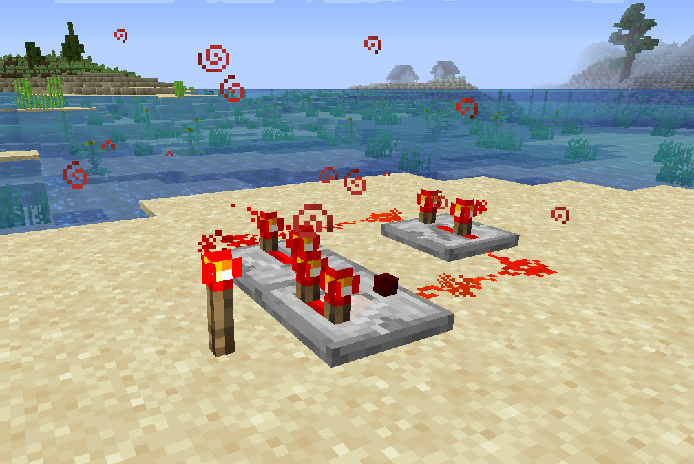

### /react help \[page\]

Use this command to show a list of commands to use

### /react installagent

Use this command to download and install the Memory Agent. See [Memory Profiling](feature/memory-profiling-with-react.md) for more info

### /react map \(toggle\) \[options\]

Use this command to toggle the scrollable map

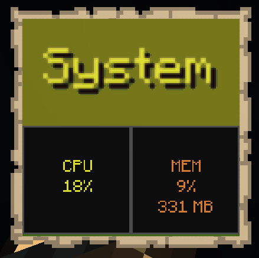

### /react memory \[plugin/top\]

Use this command to display memory information in your chat

### /react monitor \(toggle\) \[options\]

Use this command to toggle the actionbar monitor which is using the [Samplers](samplers.md)

* TPS \(green\)
* Memory Use \(gold\)
* Loaded Chunks \(red\)
* Entities \(aqua/cyan\)

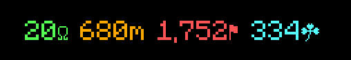

By quickly double tapping shift the monitor actionbar gets locked or unlocked

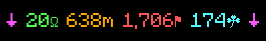

In unlocked state you can scroll through the four pages of the monitor

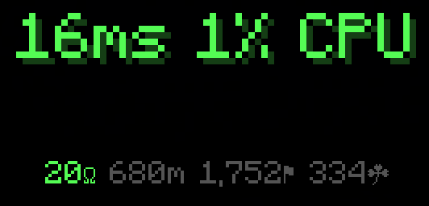

* The first Number represents the servers Tick time \(ms\)
* The seond Number represents the current cpu process usage

```text
20 tps means 20 ticks per second. There are 1,000 ms in a single second
Means the server can spend up to 50 milliseconds during a single tick before it
drops below 20 tps (which is the targeted tps for every minecraft server to have
the best experience while playing on it)
```

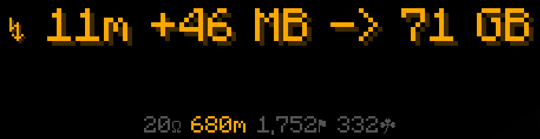

* The first Number represents Memory allocated per second
* The second Number represents the Samples memory totals

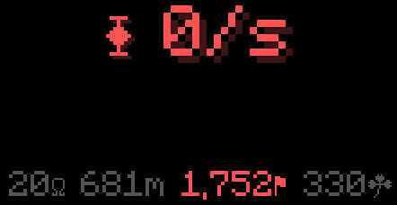

* This Number represents the Chunks loaded per second

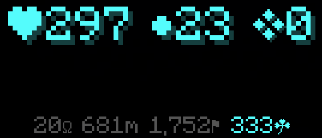

* The first Number represents the Living entity count \(mobs\)
* The second Number represents the Drop count
* The third Number represents the Tile entity count

### /react ping \[player\] \[opts\]

Use this command to view and graph realtime ping \(nanosecond accuracy\)

### /react reload \[options\]

Use this command to reload react

### /react requests

Use this command to show all current requests for temp access to react

### /react revoke \[player\]

Use this command to revoke access from an already accepted user

### /react scoreboard \(toggle\)

Use this command to toggle Scoreboard Monitoring

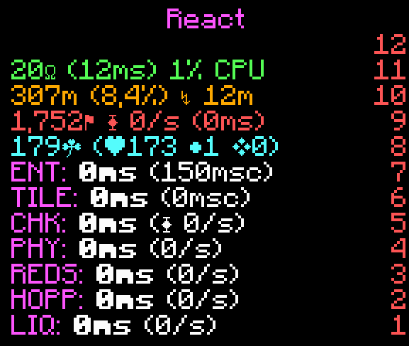

### /react status

Use this command to give yourself a book of status information

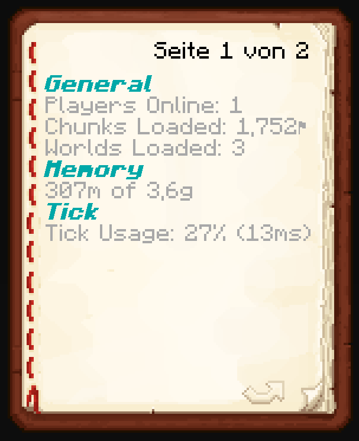

### /react subscribe \[channel\]

Use this command to subscribe to a notification channel

### /react top

Use this command to show a list of the hardest hitting chunks

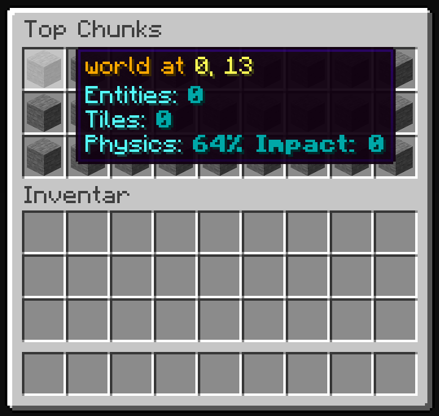

### /react tps

Use this command to display cpu and tick information

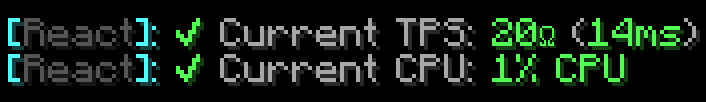

### /react unsubscribe \[channel\]

Use this command to unsubscribe to a notification channel

### /react version

Use this command to get react's version

## React AI Commands

### /rai toggle

This command toggles the React AI on or off

### /rai goals

This command gets RAI's Status

### /rai goals export

This command exports Goals

### /rai goals import &lt;code/url&gt;

This command imports Goals


See [actions ](actions/)for more details of how to set goals up


