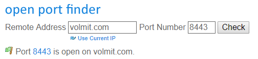
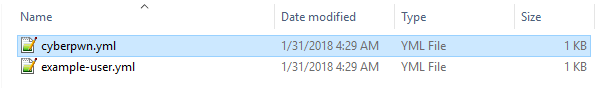

# React Remote

## React Remote

This is a setup guide for using [React Remote](https://polymart.org/resource/react-remote-application.694) which will explain everything you need, and how to set it all up!

### System Requirements & Prerequisites

Before we start, it would be wise to ensure you have everything needed to set up react remote.

* The React Remote Desktop Application
* A server with the plugin React installed and running.
* A means of accessing and editing react's configuration files 
* The ability to **forward and open ports on the server**

### Choose & Open a port on the server

You are going to need to pick a port to use for react remote. You **cannot use your server's game port.** Just like dynmap, you will need to choose an unused port which the react plugin can use to communicate with the application. Once you have chosen a port, ensure it is exposed \(and open\). To ensure you have properly forwarded a port, you can use [Port Forwarding Tester](https://www.yougetsignal.com/tools/open-ports/) which is very useful.



### Configure React on the server

Once you have made sure your chosen port is open and accessible, we will need to navigate through some of react's configuration to set it up.

Navigate to **plugins/React/config.yml** and edit the configuration

```yaml
react-remote:

  # TURN THIS ON
  enable: true

  # SET THIS TO YOUR PORT YOU OPENED BEFORE
  port: 8443

  # Should React automagically attempt to restart the server 
  # should it fail?
  auto-restart: true
```

Once you have set that, run **/react reload** either from the console or ingame to spin up the server. If you see any errors, that usually means that there is ANOTHER service already on that port. For example if you used 25565, it would fail because minecraft would be using that port.

Once reloaded, navigate to **plugins/React/remote-users**. There is a file in this folder named **example-user.yml**. Do not edit this file. Instead **COPY THIS FILE** and rename your copy to a username.



Once you have duplicated the example user file and renamed it to a username, edit your new "user" file.

```yaml
# PICK A SECURE PASSWORD
password: somESupErSeCUR%Pa$$WORd?%$$f%
permissions:
  console:

    # THIS ALLOWS CONSOLE VIEWING
    view: true

    # THIS ALLOWS RUNNING COMMANDS IN THE CONSOLE
    use: true
  actions:

    # THIS ALLOWS RUNNING ACTIONS
    use: true

# YOU MUST ENABLE THIS TO USE THIS USER
enabled: true

# VERY IMPORTANT!!!!!!!
# THIS MUST MATCH THE FILE NAME! (ignoring .yml)
username: cyberpwn
```

Once you have edited this file \(username\) to your liking, you can add more if you have multiple people who need to use the client to manage or view your server. Once you have set these users up, run **/re reload**.

### Connect!

* Your server IP \(or domain\)
* The port you picked to open and setup react with
* A user you setup with it's username
* That user's password

Simply spin up the application and enter

