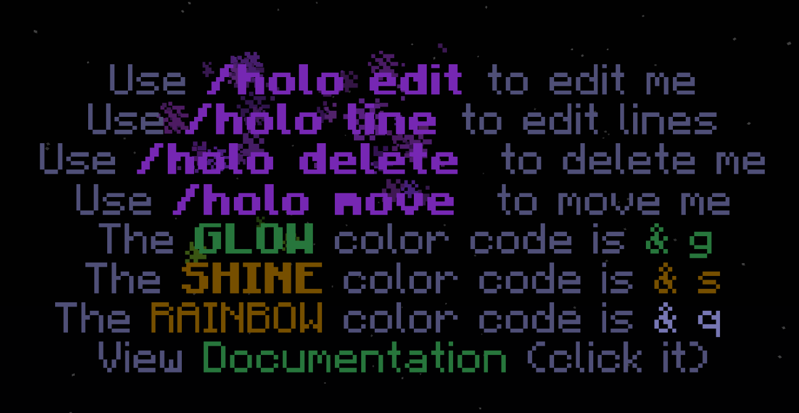

# Holograms

## Gloss Hologram Features

* Gloss Holograms always face you by pivoting to your direction
* Gloss Holograms are 100% packets. They do not exist on the server, meaning no other plugins can kill them, nor does the server tick any armor stands
* Gloss Holograms can animate up to 60 times per second

## Working with Holograms

Holograms are fairly easy to work with. The base command is **/hologram** or **/holo**

### Creating Holograms

Holograms can easily be created with the following: 


/holo new &lt;name&gt;


### Moving Holograms

You can easily move holograms to position them where you want. Simply look at a hologram and use the following command


/holo move


You can then look and move around \(the hologram will track your cursor\). You can also move the hologram in and out via scrolling with your mouse wheel.


You can hold SHIFT \(crouch\) to lock the hologram's position on the block grid \(if you want to center the hologram on a block\)


Once you have a spot, simply left click or press F \(if you are on 1.9+\) to place the hologram

### Hologram Management

You can easily find and manage holograms via GUI. Simply use: 


/holo list


The descriptions for each node in the gui informs you about the world the hologram is located in and a preview of the hologram's text if you cant remember which one it was.

### Editing Holograms

There are three ways to edit a hologram, and certain ways may be better suited for your situation than others. 



Editing via book has the best of both worlds when it comes to ease of use and power. However it does have certain limitations such as rewriting a word in a line. Simply look at a hologram and use: 


/holo edit


Then open the book to edit it. **Each page is a new line in the hologram**


When you are done editing, click DONE. You do not need to sign and close the book. You can continue to open the book and edit it, seeing the changes as you make them.




If you need to make small changes that would be annoying via book editing \(since you cannot edit written lines without deleting the entire line first\), editing line by line may be easier.


/holo line 0 &aFirst line is 0, second line is 1, etc




Another option is by editing the hologram descriptor in Gloss's data folder located at **Gloss/holograms/&lt;name&gt;.json.** From here, any changes you make are magically hotloaded directly into the hologram \(you dont need to reload after editing the hologram file\).



